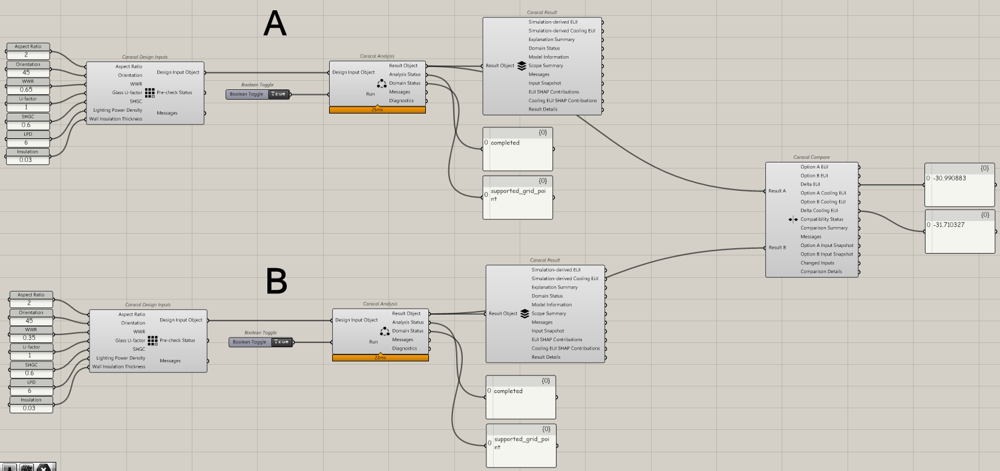
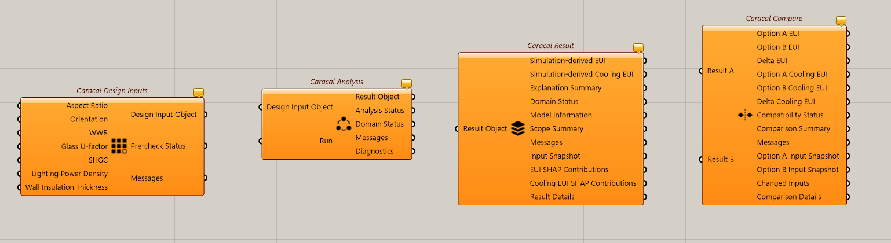
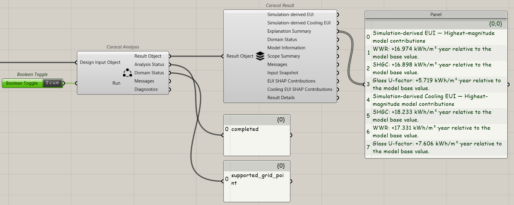
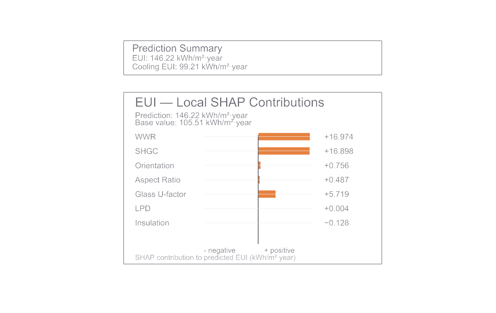
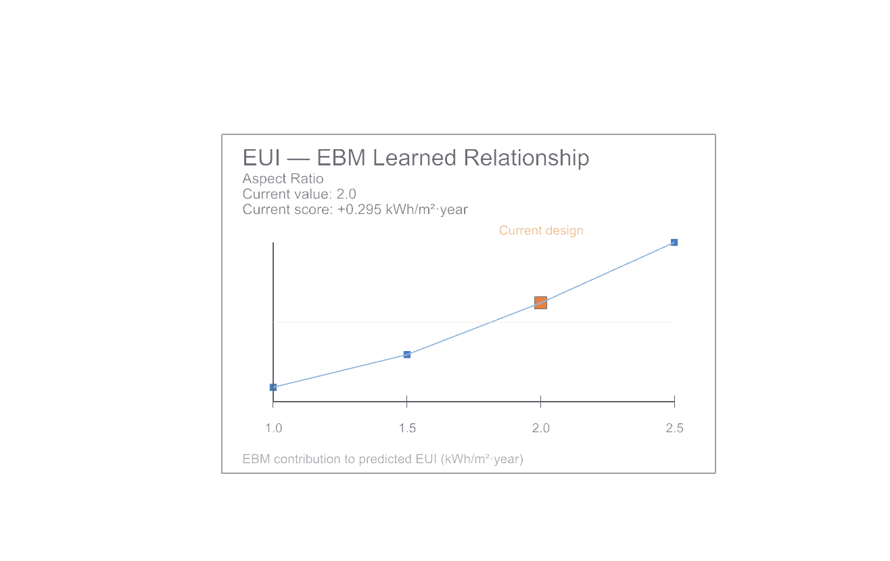
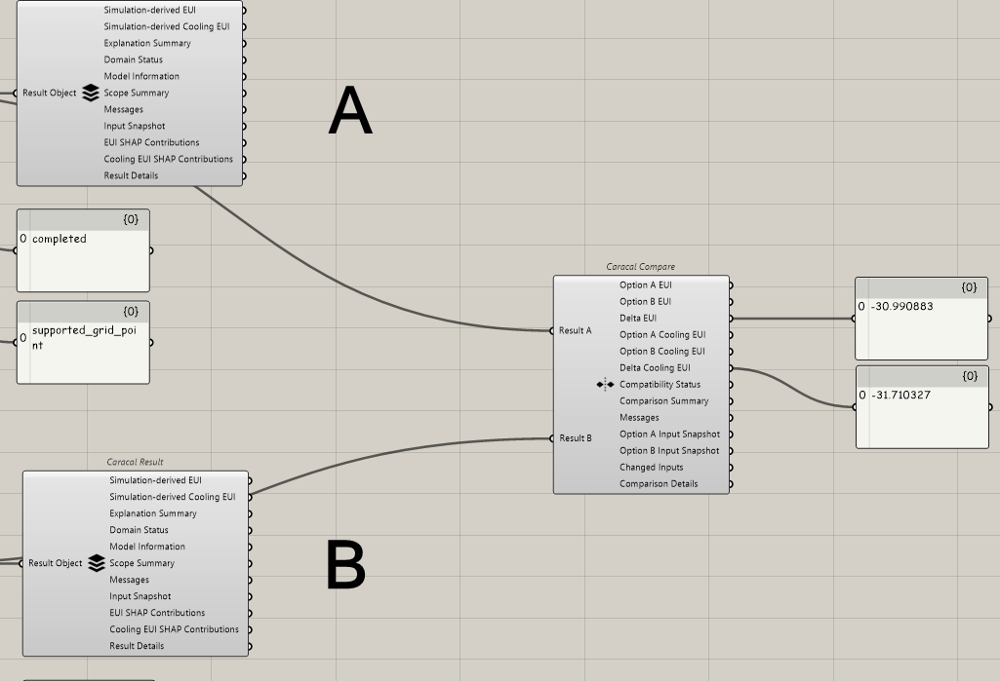

  

# Caracal

_Explainable Energy Prediction for Early-Stage Architectural Design_

Caracal v0.1.0 is experimental research software and a public MVP for its defined research domain. It is not production-certified building-energy software.

Internally, the authoritative project governance status remains unchanged:

- Approved for Integration Development — Candidate Only
- Production Promotion = NOT APPROVED

Source code status for v0.1.0:

- Source code = PRIVATE

Binary release status for v0.1.0:

- Public under `Caracal Binary License — Research & Evaluation Release v0.1.0`
- oriented to research, education, evaluation, and non-commercial exploration
- commercial/professional use requires permission
- third-party components remain under their respective upstream licenses

Canonical repository:

- https://github.com/Alirezaoroomiei/caracal-grasshopper

Published v0.1.0 release:

- https://github.com/Alirezaoroomiei/caracal-grasshopper/releases/tag/v0.1.0

## Overview

Caracal is a Grasshopper-based research software workflow for simulation-derived early-stage energy prediction in a fixed validated research domain. It combines surrogate prediction with interpretable output views so users can inspect both the numerical result and the bounded reasoning context around it.

## What problem Caracal addresses

Early-stage architectural design often needs faster feedback than full detailed simulation can provide for every iteration. Caracal addresses that need by packaging a bounded workflow for:

- simulation-derived EUI prediction
- simulation-derived Cooling EUI prediction
- local explanation of each prediction
- interpretable design-space relationship views
- neutral comparison between two analyzed options

Caracal is not presented as a replacement for detailed simulation.

## Key capabilities

- Grasshopper-native workflow with four public components
- local/offline packaged runtime
- no system Python requirement for normal use
- no internet requirement for normal use
- two prediction targets: EUI and Cooling EUI
- local SHAP explanation outputs for both targets
- EBM relationship and interaction views in the Result workflow
- Compare workflow with Delta B−A reporting
- fail-closed behavior for unsupported inputs

## Workflow

1. Enter the seven supported design inputs in Caracal Design Inputs.
2. Pass the Design Input Object into Caracal Analysis.
3. Set `Run = True`.
4. Review the completed Result Object in Caracal Result.
5. Optionally compare two completed Result Objects in Caracal Compare.

## The four Grasshopper components

### Caracal Design Inputs

Collects the seven required input values and creates a versioned Design Input Object after a pre-check for missing, non-numeric, and non-finite values.

### Caracal Analysis

Checks the Design Input Object against the supported research domain and, when eligible, produces a complete Result Object containing predictions and explainability payloads.

### Caracal Result

Displays the two prediction targets, explanation summary, scope summary, full SHAP contribution payloads, and EBM relationship/interaction views.

### Caracal Compare

Compares two completed Result Objects and reports neutral numerical differences as Option B minus Option A.

## XGBoost, SHAP, and EBM roles

- XGBoost is the primary surrogate prediction model.
- SHAP provides local explanation of the XGBoost prediction for the current design.
- EBM is an independent interpretable reference model for learned design-space relationships and interactions.

EBM is not presented as an explanation of XGBoost.

## Supported research domain

Caracal v0.1.0 operates only on approved supported research-grid points for seven inputs:

- Aspect Ratio
- Orientation
- WWR
- Glass U-factor
- SHGC
- Lighting Power Density
- External Wall Insulation Thickness

Inputs that are off-grid or outside the approved domain do not receive silent snapping or interpolation approval. See `docs/SUPPORTED_DOMAIN.md`.

## Installation

See `docs/INSTALLATION.md`.

Verified public requirements:

- Windows
- Rhino 8
- Rhino running under `.NET 8 / NetCore`

## Quick start

See `docs/QUICK_START.md`.

The documented quick-start example uses this supported case:

- Aspect Ratio = `2.0`
- Orientation = `45`
- WWR = `0.65`
- Glass U-factor = `1.0`
- SHGC = `0.60`
- Lighting Power Density = `6`
- External Wall Insulation Thickness = `0.03`

Expected analysis state:

- Analysis Status = `completed`
- Domain Status = `supported_grid_point`

Example definition support:

- `examples/Caracal_Quick_Start.gh` — manually created and native-validated with the accepted Caracal candidate
- `examples/Caracal_Compare_Example.gh` — manually created and native-validated with the accepted Caracal candidate

## Compatibility

- Windows required
- Rhino 8 required
- `.NET 8 / NetCore` Rhino host runtime required
- independently validated host: Rhino 8 SR33 `8.33.26188.13001`
- current build references Grasshopper SDK `8.22.25217.12451`

Do not interpret this as evidence that all Rhino 8 versions are supported.

## Scientific limitations

- Caracal predicts simulation-derived outputs, not measured building performance.
- Caracal is bounded to a fixed research context and supported research grid.
- Caracal is not an EnergyPlus replacement.
- Caracal is not an optimizer or automatic best-design finder.
- Caracal does not provide causal interpretation.
- Caracal does not provide confidence or reliability scoring.
- Caracal does not guarantee energy savings.

See `docs/LIMITATIONS.md`.

## Screenshots

Selected planned repository visuals:

The full screenshot set and asset purpose map are documented in `media/MEDIA_MANIFEST.md` and `media_plan/SCREENSHOT_CAPTURE_PLAN.md`.

## Citation

Caracal should be cited as research software when used in scholarly or research contexts.

- `CITATION.cff`
- `docs/CITATION.md`

No DOI is assigned in this draft package.

## Acknowledgements

Creator, software developer, and researcher:

- Alireza Oroomiei

Affiliation:

- School of Architecture, Iran University of Science and Technology (IUST)

Academic supervision / research-context acknowledgement:

- Dr. Morteza Rahbar
- Dr. Mohamadali Khanmohamadi

## Support

Support model for v0.1.0 is best-effort.

Planned primary support channel:

- GitHub Issues

Repository:

- https://github.com/Alirezaoroomiei/caracal-grasshopper

See `SUPPORT.md`.

## Release status

- Release: `v0.1.0`
- Primary terminology: `Experimental research software`
- Secondary terminology where context permits: `Public MVP`
- Public meaning: bounded public research release for a defined domain, not production certification
- Internal authoritative project status remains: `Approved for Integration Development — Candidate Only`
- Production Promotion: `NOT APPROVED`
